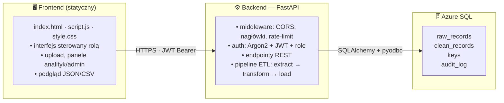

# 🔒 GDPR Live Inspector

System zarządzania danymi osobowymi zgodny z RODO — od wczytania pliku, przez
walidacyjny pipeline ETL, po realizację praw osób, których dane dotyczą.

Aplikacja edukacyjna pokazująca RODO **w praktyce**: jak bezpiecznie przyjąć,
zwalidować, przechowywać i zarządzać danymi osobowymi, z pełnym audytem i
podziałem ról.

---

## 📐 Architektura



**Kluczowe decyzje:**
- **Rozdział danych** — dane operacyjne (`clean_records`) oddzielone od wrażliwych
  (`keys`: PESEL, imię, nazwisko, data ur.), połączone tylko przez `id`
  (pseudonimizacja zgodna z RODO).
- **Surowa kopia** — każdy wczytany plik trafia najpierw do `raw_records`
  (rozliczalność).
- **Audyt przekrojowy** — każda operacja (SELECT/INSERT/UPDATE/DELETE/LOGIN)
  zapisywana do `audit_log`.

---

## 🛠️ Stack technologiczny

| Warstwa | Technologie |
|---|---|
| Frontend | HTML5, CSS3, Vanilla JavaScript (bez frameworka, hosting statyczny) |
| Backend | Python, FastAPI, Uvicorn |
| Dane / ETL | pandas, phonenumbers |
| Baza | Azure SQL Server (SQLAlchemy + pyodbc, ODBC Driver 18) |
| Auth / Bezpieczeństwo | pwdlib (Argon2), PyJWT, slowapi (rate-limiting) |
| Deploy | Docker, Render (backend), GitHub Pages / Netlify (frontend) |

---

## 🧩 Funkcjonalności wg ról

- **👤 Użytkownik** — upload pliku JSON/CSV (do 50 MB), pobranie szablonu,
  podgląd danych (JSON z kolorowaniem, sortowalne tabele CSV), wysyłka do pipeline.
- **📊 Analityk** — przeglądanie rekordów `clean_records` z filtrami
  (status, cel), paginacją i sortowaniem.
- **🛡️ Administrator** — pełne operacje RODO: podgląd danych osoby, edycja,
  eksport CSV, zmiana zgód, zamrażanie/odmrażanie, usuwanie, status pipeline.

---

## 🔁 Pipeline (ETL)

```
Plik CSV/JSON → POST /pipeline/run → EXTRACT → TRANSFORM → LOAD → AUDYT
                                     (raw_records) (walidacja) (clean_records + keys)
```

1. **Extract** — wczytanie pliku, zapis surowej kopii do `raw_records`.
2. **Transform** — normalizacja (telefon, e-mail, daty) i walidacja; każdy wiersz
   dostaje status **VALID / INVALID / DUPLICATE** + powód (nie usuwa danych).
3. **Load** — podział na `clean_records` (operacyjne) i `keys` (wrażliwe).

> Szczegóły: zobacz `PIPELINE_OPIS.txt`.

---

## ⚖️ RODO — realizacja praw

| Prawo osoby | Artykuł | Endpoint |
|---|---|---|
| Dostęp do danych | Art. 15 | `GET /my-data` |
| Przenoszenie (eksport CSV) | Art. 20 | `GET /export_data` |
| Sprostowanie | Art. 16 | `GET /change-data` |
| Bycie zapomnianym | Art. 17 | `DELETE /records` |
| Ograniczenie przetwarzania | Art. 18 | `POST /freeze`, `/un_freeze` |
| Wycofanie / zmiana zgody | Art. 7 | `POST /change_consent` |
| Rozliczalność | Art. 5 | `audit_log` |

> Szczegóły: zobacz `RODO_OPIS.txt`.

---

## 🔐 Bezpieczeństwo

- Hasła hashowane **Argon2** (`pwdlib`) — nigdy w postaci jawnej.
- **JWT** (access + refresh), rola zapisana w tokenie, autoryzacja per rola
  (`require_role`).
- Blacklista tokenów przy wylogowaniu, blokada konta po 5 nieudanych próbach.
- **Rate-limiting** (slowapi), nagłówki bezpieczeństwa (X-Frame-Options,
  X-Content-Type-Options, HSTS, CSP), zapytania parametryzowane.

---

## 🚀 Uruchomienie lokalne

### 1. Wymagania
- Python 3.11+
- Sterownik **ODBC Driver 18 for SQL Server**
- Działająca instancja Azure SQL (lub kompatybilna)

### 2. Instalacja
```bash
python -m venv venv
source venv/bin/activate        # Windows: venv\Scripts\activate
pip install -r requirements.txt
```

### 3. Zmienne środowiskowe (`.env`)
```env
AZURE_SERVER=...
AZURE_DATABASE=...
AZURE_USERNAME=...
AZURE_PASSWORD=...
SECRET_KEY=...                  # klucz do podpisu JWT
ALGORITHM=HS256
ACCESS_TOKEN_EXPIRE_MINUTES=30
```

### 4. Backend
```bash
uvicorn backend.main:app --reload --port 8000
```
API: http://localhost:8000 · dokumentacja interaktywna: http://localhost:8000/docs

### 5. Frontend
Otwórz `index.html` (np. przez Live Server na porcie 5500). Frontend sam wykrywa
środowisko: `localhost` → `http://localhost:8000`, w innym wypadku → backend produkcyjny.

---

## 🐳 Docker

```bash
docker build -t gdpr-live-inspector .
docker run -p 10000:10000 --env-file .env gdpr-live-inspector
```
Obraz instaluje sterownik `msodbcsql18` i startuje Uvicorn na porcie `${PORT:-10000}`.

---

## ☁️ Deployment

- **Backend** — Render (Docker). Ustaw zmienne środowiskowe w panelu Render.
- **Frontend** — GitHub Pages lub Netlify (nagłówki bezpieczeństwa w `netlify.toml`
  i `_headers`).
- CORS w `backend/main.py` zezwala na originy frontu (localhost + GitHub Pages).

---

## 📁 Struktura projektu

```
.
├── backend/
│   ├── main.py            # FastAPI: endpointy (auth, pipeline, records, RODO)
│   └── auth.py            # JWT, hashowanie haseł, role
├── pipeline/
│   ├── extract.py         # wczytanie pliku → raw_records
│   ├── transform.py       # normalizacja, walidacja, podział na tabele
│   └── load.py            # silnik bazy, zapis, audyt
├── index.html             # frontend — panele upload/analityk/admin/auth
├── script.js              # logika frontu (auth, upload, tabele)
├── style.css              # style
├── TEST_DATA/             # dane testowe (CSV)
├── Dockerfile             # obraz backendu (z ODBC Driver 18)
├── netlify.toml / _headers# nagłówki bezpieczeństwa frontu
├── requirements.txt       # zależności Pythona
├── PIPELINE_OPIS.txt      # szczegółowy opis pipeline'u
└── RODO_OPIS.txt          # mapowanie praw RODO na endpointy
```

---

## 📖 Źródła

- [Rozporządzenie 2016/679 (RODO)](https://eur-lex.europa.eu/eli/reg/2016/679/oj)
- [UODO](https://uodo.gov.pl/) — Urząd Ochrony Danych Osobowych
- [Dokumentacja FastAPI](https://fastapi.tiangolo.com/)

---

## 📄 Licencja

Projekt edukacyjny — używaj swobodnie w celach dydaktycznych. 🎓

---

## 👤 Autor

**Miłosz Płocki**
[LinkedIn](https://www.linkedin.com/in/mi%C5%82osz-p%C5%82ocki-5b3439400/)
